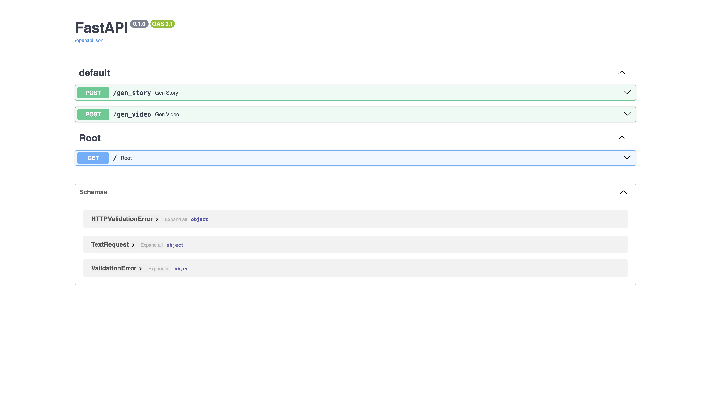
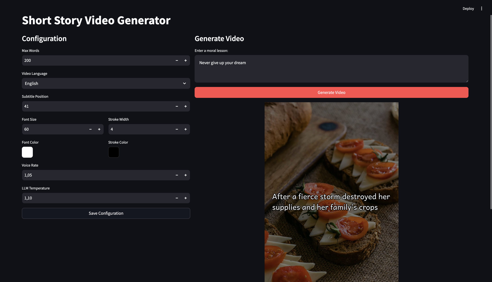

# Daily Story

## How to Run

1. Obtain a Pexels API key from [here](https://www.pexels.com/).
2. Create a `.env` file and add the API key under the `PEXELS_API_KEY` variable:
    ```bash
    PEXELS_API_KEY=<your_api_key>
    ```
3. Modify the `config.yaml` file as needed.
4. Run the application with:
    ```bash
    docker compose up
    ```
    - Access the **Web App** at [`http://localhost:8501/`](http://localhost:8501/).
    - Access the **API Documentation** at [`http://localhost:8000/docs`](http://localhost:8000/docs).
    - The generated short videos will be saved in the `output_folder` specified in `config.yaml`. The default location is `./output`.

## Screenshots

### APIs



### Web App

